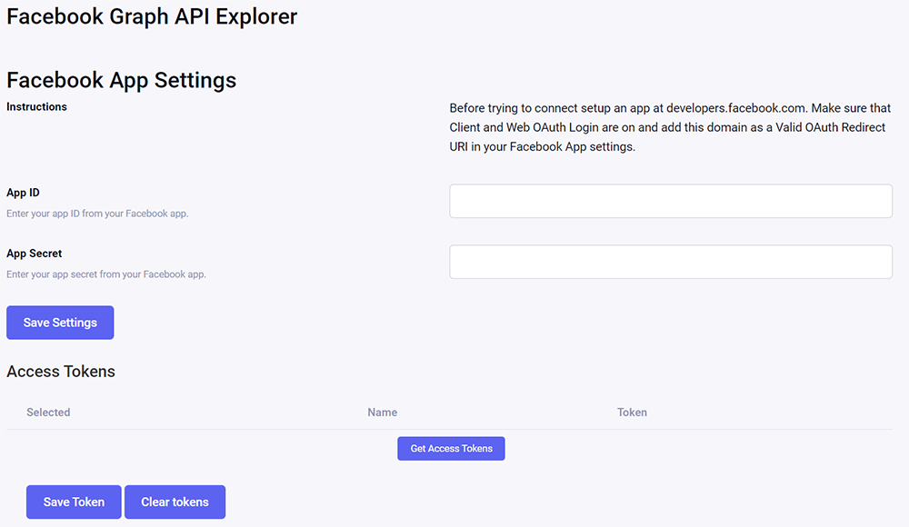

# Facebook Graph API Explorer

Facebook and Instagram feeds on your website the way _you_ want it!

Works only for Facebook Pages and Instagram Business/Creator accounts, not for personal profiles.

Facebook and Instagram have nice widgets to embed in your website. And in many occasions the recommended way to add Facebook and/or Instagram to your website. But those widgets display limited data and are very hard to customize.

What if you want to display some specific data those widgets do not provide, or you want to add your own visual style to the output? Enter the Facebook Graph API Explorer for ExpressionEngine.

With this add-on you can create custom Facebook Graph API and Instagram Graph API queries to get the data _you_ want. You have to apply your own styling to it so it will seamlessly fit into your website.

## Requirements

* ExpressionEngine 3+   
Tested on EE 3.5.17, EE 4.3.8, EE 5.4.0, EE 6.0.3
* a SSL (HTTPS) enabled website. Facebook requires HTTPS
* a Facebook Developer account and a Facebook App (https://developers.facebook.com/docs/development/)
* Facebook App ID and Facebook App Secret which you will get after creating an app in the Facebook Developer portal.
* Facebook Login installed in the Facebook App Dashboard.
* a Facebook Page (not a personal profile).
* For Instagram:
  * an Instagram Business account or an Instagram Creator account.
  * the Instagram Graph API installed in the Facebook App Dashboard.
* The correct permissions (_You may have to apply for App Review_):
  * For a Facebook page at least: `manage_pages`, `pages_show_list`
  * For Instagram: `instagram_basic`
* Website domain(s) added to:
  * `App Dashboard -> Settings -> Domain Manager`
  * `App Dashboard -> Facebook Login -> Settings-> Valid OAuth Redirect URIs`

## Installation

* Download the add-on from GitHub and unzip the file to a folder of your choice
* Copy `fb_graph_api/fb_graph_api` folder to `./system/user/addons/fb_graph_api`
* Go to the add-ons page in your control panel and install the add-on
* Go to the settings page of the add-on and fill in the form (App ID and App Secret) and click the `Save Settings` button.
* After saving the settings click the `Get Access Tokens` button. A list of pages you manage will appear
* Select the Facebook page you want to query and click the `Save Token` button
* The Facebook Graph API Explorer add-on is now installed and activated



## Usage

### `{exp:fb_graph_api:get}`

#### Example Usage Facebook

```
{exp:fb_graph_api:get node_id="FACEBOOK PAGE ID or FACEBOOK PAGE ALIAS" edge="posts" fields="message,full_picture,permalink_url" limit=5}
  {if full_picture}{/if}
  {message}
  {permalink_url}
{/exp:fb_graph_api:get}
```

#### Example Usage Instagram

```
{exp:fb_graph_api:get node_id="INSTAGRAM BUSINESS or CREATOR ACCOUNT ID" edge="media" fields="id,timestamp,caption,media_url,permalink,like_count,comments_count" limit="12"}
	{id}
	{timestamp}
	{caption}
	{media_url}
	{permalink}
	{like_count}
	{comments_count}
{/exp:fb_graph_api:get}
```

#### Parameters

##### node_id (*required*)

[Facebook Page ID | Facebook Page Alias | Instagram Business Account ID | Instagram Creator Account ID]

Examples for the [ExpressionEngine Facebook page](https://www.facebook.com/expressionengine/):

`{exp:fb_graph_api:get node_id="expressionengine"}`

`{exp:fb_graph_api:get node_id="359401999932"}`

##### edge

Browse the [Facebook Graph API documentation][Facebook Graph API] and [Instagram Graph API documentation][Instagram Graph API]  for available edges.

Examples of getting events by using the events edge:

`{exp:fb_graph_api:get node_id="[NODE ID]" edge="events"}`

##### fields

Browse the [Facebook Graph API documentation][Facebook Graph API] and [Instagram Graph API documentation][Instagram Graph API]  for available fields.

Examples for getting specific event fields:

```
{exp:fb_graph_api:get node_id="[NODE ID]" edge="events" fields="id, name, description, cover{source}"}
	{id}
	{name}
	{description}
	{cover}
		{cover:source}
	{/cover}
{/exp:fb_graph_api:get}
```

_Notice the selection of the subfield `source` of the `cover` field and the way to display the selected subfield._

##### include_canceled

Facebook Page only. Does not work for Instagram.

This is an optional parameter but if you want to display canceled events it is required.
Facebook omits canceled events by default.

`{exp:fb_graph_api:get node_id="[NODE ID]" edge="events" fields="id, name, description, is_canceled" include_canceled="true"}`

##### since

Facebook Page only. Does not work for Instagram.

To narrow down the query to start from a specific date.

`{exp:fb_graph_api:get node_id="[NODE ID]" edge="[EDGE]" fields="[FIELDNAMES]" since="2020-12-01"}`

##### until

Facebook Page only. Does not work for Instagram.

To narrow down the query to end at a specific date.

`{exp:fb_graph_api:get node_id="[NODE ID]" edge="[EDGE]" fields="[FIELDNAMES]" until="2020-12-01"}`

##### sort

Facebook Page only. Does not work for Instagram.

The fieldname to sort the query.

`{exp:fb_graph_api:get node_id="[NODE ID]" edge="[EDGE]" fields="[FIELDNAMES]" sort="[FIELDNAME]"}`

##### order

Facebook Page only. Does not work for Instagram.

The direction to order the query. Use **asc** or **desc**.

`{exp:fb_graph_api:get node_id="[NODE ID]" edge="[EDGE]" fields="[FIELDNAMES]" sort="[FIELDNAME]" order="asc"}`

##### limit

To limit the amount of data returned.

`{exp:fb_graph_api:get node_id="[NODE ID]" edge="[EDGE]" fields="[FIELDNAMES]" limit="10"}`

##### json

Returns pure JSON. All other parsing is omitted. Great when you want to use it in a JavaScript driven app i.e. a React.js app.

`{exp:fb_graph_api:get node_id="[NODE ID]" edge="[EDGE]" fields="[FIELDNAMES]" json="true"}`

#### Variables

The variables this add-on returns match the fieldnames you select in the tag.

## Changelog

### 1.0.2

* Fixed initial install error notices where an undefined array was referenced
* Restructured the repo and rewritten readme.md as per ExpressionEngine guidelines
* Removed `{data}{/data}` tag pair from the output. The `data` item remains as top level item in JSON output

### 1.0.1

- Renamed constant `GRAPH_VERSION` to `FACEBOOK_GRAPH_VERSION` to avoid conflict with Ron Hickson's fb_link add-on
- Renamed `graph()` function to `get()`
- Renamed parameter `user_id` to `node_id`
- Updated readme.md
- Fixed pure JSON output
- Fixed typo in class name
- Ensured backward compatibility

### 1.0.0

- Released!

## Acknowledgement

This add-on is built on Ron Hickson's Facebook Link add-on and 99% of the code was written by him. I merely adapted the code to play nice with EE6 and make it more user-friendly by adding some parameters.

Without Ron Hickson this add-on would probably never have come to life.

Ron's Facebook Link add-on can be found at:

* Devot-ee: [https://devot-ee.com/add-ons/facebook-link](https://devot-ee.com/add-ons/facebook-link)
* Github: [https://github.com/rhgarage/fb_link](https://github.com/rhgarage/fb_link)
* EE-Forge: [https://ee-forge.com/add-ons/facebook_link


[Facebook Graph API]: https://developers.facebook.com/docs/graph-api/using-graph-api
[Instagram Graph API]: https://developers.facebook.com/docs/instagram-api
